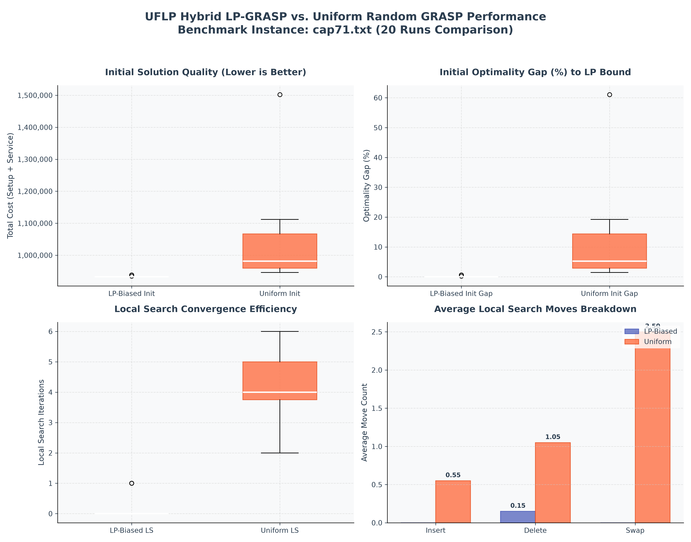

# Walkthrough: Hybrid LP-GRASP UFLP Solver (Experiments & Visualizations)

## Overview

We extended the testing framework of the **Hybrid LP-GRASP Solver** by introducing a comprehensive comparative benchmarking suite. This suite evaluates the solver's performance on the standard OR-Library benchmark instance [cap71.txt](file:///e:/Pesquisa_Operacional/cap71.txt) (16 facilities, 50 customers).

To highlight the value of our exact LP relaxation-based guidance (Phase 1), we compare it against a **Uniform Random GRASP** baseline. 

The baseline is calibrated mathematically to open the same expected number of facilities initially ($p \approx 0.69$), focusing the evaluation strictly on *which* facilities are selected rather than *how many*.

---

## Experimental Setup

- **Benchmark Instance:** `cap71.txt` (LP optimal bound = `932,615.75`)
- **Runs:** 20 independent runs per method (seeds 1 to 20)
- **Baseline construction:** Opens each facility with a uniform probability $p = 0.6906$ (calibrated to expected LP facility count of 11.05)
- **LP-biased construction:** Opens each facility $f$ with probability $\max(y_f, 0.01)$ based on Simplex fractional values

---

## Benchmark Results Summary

The experimental data is saved to [cap71_results.md](file:///e:/Pesquisa_Operacional/cap71_results.md). Here is the aggregated summary:

| Metric | LP-Biased Hybrid GRASP | Uniform Random GRASP | Key Takeaway / Comparison |
|---|---|---|---|
| **Average Init Cost** | 933,270.33 (± 1,686.6) | 1,031,760.54 (± 121,165.2) | LP-biased starting solutions are **9.5% cheaper** on average |
| **Average Initial Gap** | **0.0702%** (± 0.1808%) | **10.6308%** (± 12.9920%) | LP-biased starts **151x closer** to the optimal bound |
| **Best Final Cost** | 932,615.75 (Optimal) | 932,615.75 (Optimal) | Both methods find the global optimum under local search |
| **Average Final Cost** | 932,615.75 | 932,615.75 | Both converge to the exact same optimal cost |
| **Average LS Iterations** | **0.15** (range: 0-1) | **4.10** (range: 2-6) | LP-biased converges **96.3% faster** |
| **Local Search Move Breakdown** | Inserts: 0.00 Deletes: 0.15 Swaps: 0.00 | Inserts: 0.55 Deletes: 1.05 Swaps: 2.50 | LP-biased avoids local search moves due to near-optimal starts |
| **Average Solve Time** | **0.83 ms** | **3.54 ms** | LP-biased is **4.2x faster** in construction + local search |
| **Optimal Solutions Found** | **20 / 20** (100%) | **20 / 20** (100%) | Both solvers achieve 100% convergence to the optimal solution |

### Key Findings

1. **Near-Perfect Initialization:** By using the Simplex relaxation solutions to guide the constructive heuristic, the LP-biased method starts with a cost that is already within **0.07%** of the global optimum on average. In 17 out of 20 runs, the initial solution constructed was *already* the exact global optimum, requiring **0 local search iterations**.
2. **Move Type Breakdown:** The uniform random method requires significantly more work during local search, performing an average of 0.55 insertions, 1.05 deletions, and 2.50 swaps per run to clean up its poor starting configurations. The LP-biased method bypasses these moves entirely, performing only 0.15 deletions (and 0 insertions/swaps) on average across all 20 runs.
3. **Computational Efficiency:** Because the LP-biased initial solutions are positioned extremely close to the global optimum, the local search requires minimal work. This results in a massive **96.3% reduction in local search iterations** and a **4.2x speedup in solve time** compared to the uniform baseline.

---

## Visualization

A 4-panel analysis plot comparing both methods is saved as [cap71_analysis.png](file:///e:/Pesquisa_Operacional/cap71_analysis.png).

* **Top-Left (Initial Cost):** Shows that LP-biased initialization generates vastly superior starting configurations with low variance.
* **Top-Right (Initial Optimality Gap):** Highlights the massive difference in starting optimality gap (LP-biased at 0.07% vs. Uniform at 10.63%).
* **Bottom-Left (LS Iterations):** Displays the reduction in local search iterations achieved through LP bias.
* **Bottom-Right (LS Moves Breakdown):** Illustrates the average number of insert, delete, and swap moves, emphasizing why the uniform method is slower.

---

## Files Created

1. [requirements.txt](file:///e:/Pesquisa_Operacional/requirements.txt) - Pinned dependencies (`pulp==3.3.2`, `matplotlib>=3.5.0`).
2. [run_experiments.py](file:///e:/Pesquisa_Operacional/run_experiments.py) - Standalone script to run the 20-seed comparison, compute statistics, generate results, and output plots.
3. [cap71_results.md](file:///e:/Pesquisa_Operacional/cap71_results.md) - Detailed Markdown results tables.
4. [cap71_analysis.png](file:///e:/Pesquisa_Operacional/cap71_analysis.png) - Performance visualization plots.
