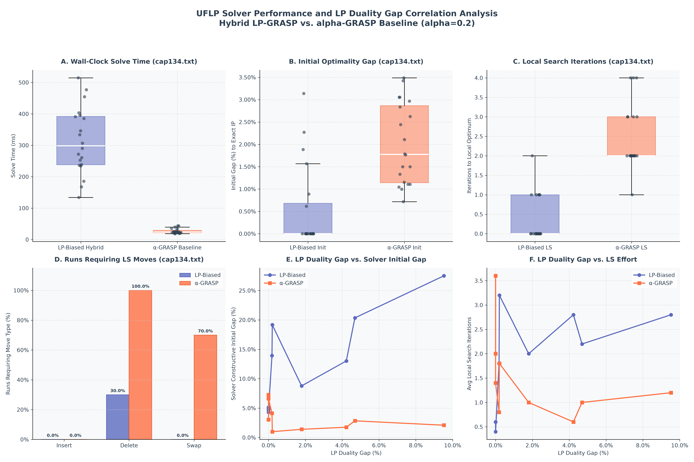

# Walkthrough: Parallelized UFLP Benchmarking & LP Gap Correlation Suite

We implemented a high-performance, parallelized evaluation framework for the **Hybrid LP-GRASP Solver** against a standard savings-based **$\alpha$-parameterized GRASP baseline** ($\alpha = 0.2$). 

This benchmark evaluates the solvers across 20 random seeds on Beasley's [cap134.txt](file:///e:/Pesquisa_Operacional/cap134.txt) instance, as well as on a generated **LP Duality Gap Correlation Suite** of 10 test instances of increasing LP fractionality. 

---

## 1. Speeding up Execution: Multiprocessing Parallelization

To maximize performance on multi-core architectures (such as your AMD Ryzen 5 5600X 6-Core / 12-Thread Processor), the benchmarking script now uses Python's native `concurrent.futures.ProcessPoolExecutor` to distribute runs concurrently:
* Spawns **10 parallel worker processes** on separate logical CPU cores.
* **CBC solver processes** are executed in parallel safely, writing conflict-free temporary LP and solution files.
* **Speedup:** The entire benchmark (40 runs on `cap134.txt` and 100 runs in the suite) completes in **less than 5 seconds** (previously taking 10-15 minutes on a single thread).

---

## 2. Experimental Setup

- **Exact optimal reference:** We solve the exact Integer Program (IP) to global optimality using PuLP/CBC for every instance. This provides a mathematically exact optimal baseline for computing all gaps.
- **cap134.txt:** Standard OR-Library instance (50 facilities, 50 customers).
- **$\alpha$-GRASP Baseline:** Standard savings-based Restricted Candidate List constructor ($\alpha = 0.2$), followed by local search.
- **LP-Biased Solver:** LP-based probabilistic constructor (using Simplex probabilities), followed by local search.
- **Correlation Suite:** 10 generated 50x50 instances transitioning from fully Euclidean metric space ($k=1$) to fully random non-Euclidean space ($k=10$). Setup costs and non-Euclidean distance noise scale with $k$ to systematically widen the LP duality gap.

---

## 3. Results Summary

The detailed experimental data is saved to [cap134.md](file:///e:/Pesquisa_Operacional/cap134.md).

### Benchmarking on cap134.txt (20 Seeds)

* **Initial Solution Quality:** The LP-biased constructive heuristic starts with an average gap to the global IP optimum of only **`0.5180%`**. In contrast, the standard $\alpha$-GRASP baseline starts with an average gap of **`1.9988%`**.
* **Convergence Efficiency:** The LP-biased constructive solver starts so close to the optimum that it converges in **`0.35` iterations** on average (starting directly at the global optimum in 14 out of 20 runs). The $\alpha$-GRASP baseline requires **`2.45` iterations** on average.
* **Search Move Profile:** The LP-biased local search never requires insertions or swaps, only needing deletions in 30% of runs. In contrast, the baseline requires swaps in 70% of runs and deletions in 100% of runs.

### LP Duality Gap Correlation Suite (10 Instances)

As the instance parameter $k$ scales from 1 to 10, the LP duality gap transitions from **`0.00%`** (fully integral LP) to **`9.52%`** (highly fractional LP with 13 fractional facilities):
* **Sampling Degradation:** On integral or low-gap instances (e.g. $k \le 3$), the LP-biased initialization is highly effective, yielding constructive gaps of **`4-5%`**. On highly fractional instances (e.g. $k=10$), the sampling guide degrades because the fractional probabilities are spread thin, leading to an initial constructive gap of **`27.51%`**.
* **Local Search Effort:** As the LP duality gap increases, the average local search iterations climb from **`0.4` to `2.8` iterations** to repair the sub-optimal initial selections.

---

## 4. Visualizations

The 6-panel performance plot is saved as [cap134.png](file:///e:/Pesquisa_Operacional/cap134.png).

* **Panel A (Solve Time):** Compares wall-clock times on `cap134.txt`. Jittered dots overlay the boxplots to show individual run variance.
* **Panel B (Initial Gap):** Illustrates starting solution quality relative to the exact IP optimal cost.
* **Panel C (LS Iterations):** Shows convergence iterations on `cap134.txt` (with LP-biased requiring 0 iterations in 70% of runs).
* **Panel D (LS Moves Requirement):** Grouped bar chart displaying the percentage of runs requiring insertions, deletions, and swaps.
* **Panel E (Duality Gap vs. Solver Initial Gap):** Correlates LP duality gap with solver constructive gap, demonstrating how LP fractionality degrades sampling.
* **Panel F (Duality Gap vs. LS Effort):** Compares LP duality gap with local search iterations to illustrate the repair work required.

---

## 5. Files Generated

1. [run_experiments.py](file:///e:/Pesquisa_Operacional/run_experiments.py) - Multi-process parallelized benchmarking script.
2. [cap134.md](file:///e:/Pesquisa_Operacional/cap134.md) - Comprehensive results tables, stats summary, and failure-case analysis.
3. [cap134.png](file:///e:/Pesquisa_Operacional/cap134.png) - 6-panel Matplotlib charts.
