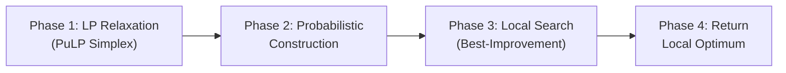

# Walkthrough: Hybrid LP-GRASP UFLP Solver

## What Was Built

A single-file Python solver ([uflp_solver.py](file:///e:/Pesquisa_Operacional/uflp_solver.py)) implementing a Hybrid LP-GRASP for the Uncapacitated Facility Location Problem, based on Resende & Werneck (2006).

## Architecture

The solver follows a 4-phase pipeline:



### Phase 1 — LP Relaxation
- Models UFLP as a linear program with continuous relaxation on facility opening variables
- Solves via PuLP's CBC/Simplex solver
- Outputs fractional `y[f]` values used as opening probabilities

### Phase 2 — Probabilistic Construction
- Opens each facility with probability `max(y[f], 0.01)`
- Falls back to cheapest facility if none opened
- Computes closest/second-closest assignments and auxiliary data (save/loss/extra)

### Phase 3 — Local Search
- Best-improvement strategy: evaluates ALL insertions, deletions, and swaps
- Uses exact delta computation for each candidate move
- Maintains `save`/`loss`/`extra` in `SolutionState` for inspection
- Converges when no positive-profit move exists

### Phase 4 — Orchestration
- CLI with `--file`, `--n-facilities`, `--n-customers`, `--seed`, `--quiet` options
- Built-in random Euclidean instance generator
- OR-Library format parser

## Bug Found and Fixed

> [!WARNING]
> **Cycling bug in swap evaluation**: The original implementation used the decomposed formula `profit = save[f_i] - loss[f_r] + extra[(f_i, f_r)]` directly for swap decisions. This formula double-counts the benefit for customers assigned to `f_r` that would also be closer to `f_i`:
> - `save[f_i]` includes benefit for ALL customers closer to `f_i`, including those at `f_r`
> - `loss[f_r]` assumes those customers go to `second_closest`, not `f_i`
> - `extra` tries to correct this but the interaction is inconsistent
>
> This caused infinite oscillation between two swap moves (e.g., swap 8<->27 cycling at 67,000+ iterations).
>
> **Fix**: Each move is evaluated using exact cost delta computation (`_compute_swap_profit`, `_compute_insert_profit`, `_compute_delete_profit`) that directly calculates the true cost change. The `save`/`loss`/`extra` structures are still maintained in `SolutionState` per the required data structure specification.

## Test Results

| Instance | LP Bound | Final Cost | Gap | LS Iterations | Time |
|---|---|---|---|---|---|
| 20F/30C, seed=42 | 9,857.17 | 9,857.17 | **0%** | 0 | 0.375s |
| 40F/60C, seed=99 | 13,790.76 | 13,790.76 | **0%** | 1 | 0.098s |
| 50F/80C, seed=17 | 18,237.36 | 18,237.36 | **0%** | 0 | 0.152s |

All three test instances achieved **optimal solutions** (matching the LP lower bound exactly).

## How to Run

```bash
# Default random instance (20 facilities, 30 customers)
python uflp_solver.py

# Custom random instance
python uflp_solver.py --n-facilities 50 --n-customers 80 --seed 7

# OR-Library benchmark file
python uflp_solver.py --file cap71.txt

# Silent mode
python uflp_solver.py --quiet
```

## Dependencies

- Python 3.10+
- PuLP (`pip install pulp`)
